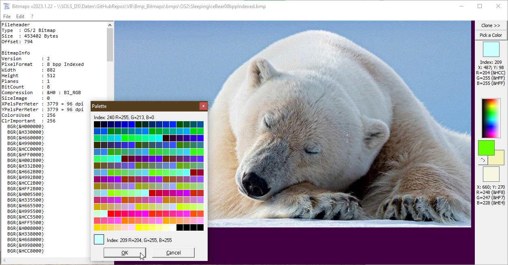

# Bmp_Bitmaps
## reading pictures in the Bitmap fileformat

 

Project started in jan.2021.  
Binary reading pictures in the bmp-fileformat aka bitmaps, windows-bmp or os/2-bmp, in uncompressed rgb or rle-compressed,
pixelformats: 1bpp 2 colors, 4bpp 16 colors, 8bpp 256 colors, 15bpp 32768 colors (555), 16bpp 65536 colors (565 / 1555), 24 bpp 16,7mio colors, 32bpp 16.7mio+255 steps of transparency. Works in VBC and in VBA7 x86 & Win64.
View all bitmap-header-data and bitmap-infos in human readable format in a textbox.

